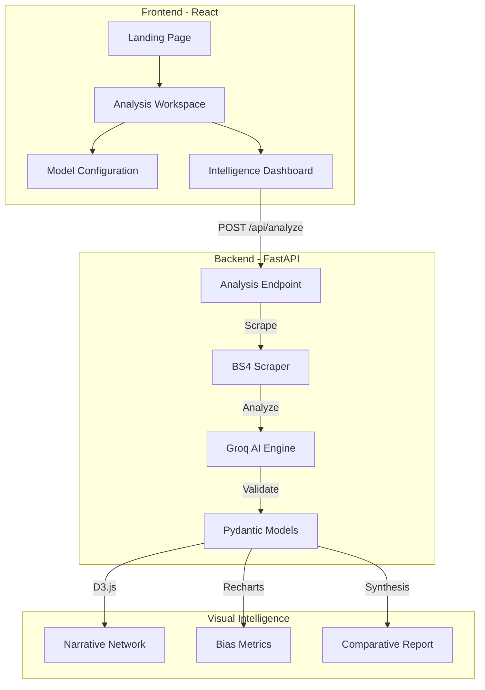

<div align="center">

  # Omnius — Automated Media Intelligence
  **Automated Framing Analysis using Robert Entman's Methodology & LLM Intelligence.**
  
  [](https://reactjs.org/)
  [](https://www.typescriptlang.org/)
  [](https://tailwindcss.com/)
  [](https://fastapi.tiangolo.com/)
  [](https://www.python.org/)
  [](https://vitejs.dev/)
  [](https://www.docker.com/)
  [](https://console.groq.com/)
  [](https://opensource.org/licenses/MIT)
</div>

---

## Overview

**Omnius** is a professional media intelligence platform that implements **Robert Entman's (1993)** framing theory to automatically dissect online news narratives. 

In an era of information warfare and systemic bias, Omnius provides a "truth-telling" lens that transforms static news text into deep analytical insights. It identifies how media outlets define problems, interpret causes, make moral evaluations, and recommend treatments across different sources.

## Core Features

- **Automated Framing Intelligence**: Identifies Robert Entman's 4 framing pillars using state-of-the-art LLMs (Llama 3.3, 3.1, and Qwen).
- **Comparative Synthesis**: Generates high-level intelligence reports that find common ground and key discrepancies between different media outlets.
- **Narrative Network Matrix**: Interactive **D3.js-powered** graph visualization that reveals the "Shared Nucleus" of keywords connecting different sources.
- **Bias Intelligence Indicator**: Real-time sentiment and bias detection across media actors and overall article tone.
- **Sleek Intelligence Workspace**: A modern, dark-themed dashboard inspired by high-end intelligence tools, featuring smooth transitions and professional typography.
- **Model Configurator**: Hot-swap between different LLM engines (Llama, Qwen) to adjust analysis depth and speed.

## Technology Stack

### Backend (Python & FastAPI)
- **Framework**: FastAPI (Asynchronous High-Performance API)
- **Web Server**: Uvicorn with Gunicorn support
- **LLM Orchestration**: Groq SDK (Llama 3.3-70B, Llama 3.1-8B, Qwen 3 32B)
- **NLP & Language**: Langdetect (Automatic article language identification)
- **Scraping Engine**: BeautifulSoup4 with **lxml** parser & Requests
- **Data Modeling**: Pydantic v2 (Strict schema and data integrity)

### Frontend (React & TypeScript)
- **Framework**: **React 19** with **Vite 6**
- **Language**: TypeScript (Strictly typed architecture)
- **Styling**: **Tailwind CSS v4** & **Motion v12** (Fluid animations)
- **Routing**: **React Router v7** (Decoupled navigation)
- **Visualization**: **D3.js** (Dynamic Network Graphs), **Recharts** (Bias Indicators)
- **Content Rendering**: **React Markdown** (LLM Synthesis display)
- **Networking**: Axios (Async HTTP requests)
- **Icons**: Lucide React

### Deployment & DevOps
- **Containerization**: Docker with **uv** (Ultra-fast Python package installer)
- **Runtime**: Node.js 22 (Frontend) & Python 3.12 (Backend)
- **Architecture**: Decoupled Monorepo (Independent Frontend & Backend)

## System Architecture



---

## Getting Started

### Prerequisites
*   Python 3.12+
*   **uv** (Fast Python package manager)
*   Node.js 22+ & npm
*   Groq Cloud API Key

### 1. Backend Setup
```bash
cd backend

# Install dependencies using uv
uv sync

# Create .env file
echo "GROQ_API_KEY=your_key_here" > .env

# Run the server
uv run uvicorn app.main:app --host 0.0.0.0 --port 8000 --reload
```

### 2. Frontend Setup
```bash
cd frontend
# Install dependencies
npm install
# Start development server
npm run dev
```

The application will be available at `http://localhost:5173`.

---

## Methodology

Omnius implements the **Robert Entman's Framing Theory (1993)**, which identifies:
1. **Problem Definition**: What is the core issue at hand?
2. **Causal Interpretation**: Who or what is blamed for the problem?
3. **Moral Evaluation**: How are the actors and actions judged?
4. **Treatment Recommendation**: What is the suggested solution or path forward?

By comparing these pillars across sources, Omnius reveals the systematic "framing" that shapes public perception.

---

## License

This project is licensed under the **MIT License**. See the [LICENSE](LICENSE) file for details.

---

## Author

**Felix Hardyan**
*   [GitHub](https://github.com/flxhrdyn)
*   [Hugging Face](https://huggingface.co/felixhrdyn)

---
<div align="center">
  Built for Objective Media Analysis.
</div>
