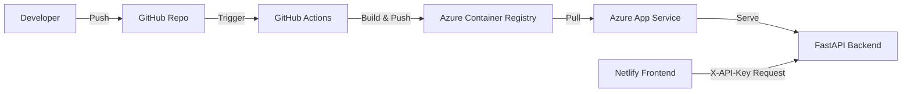
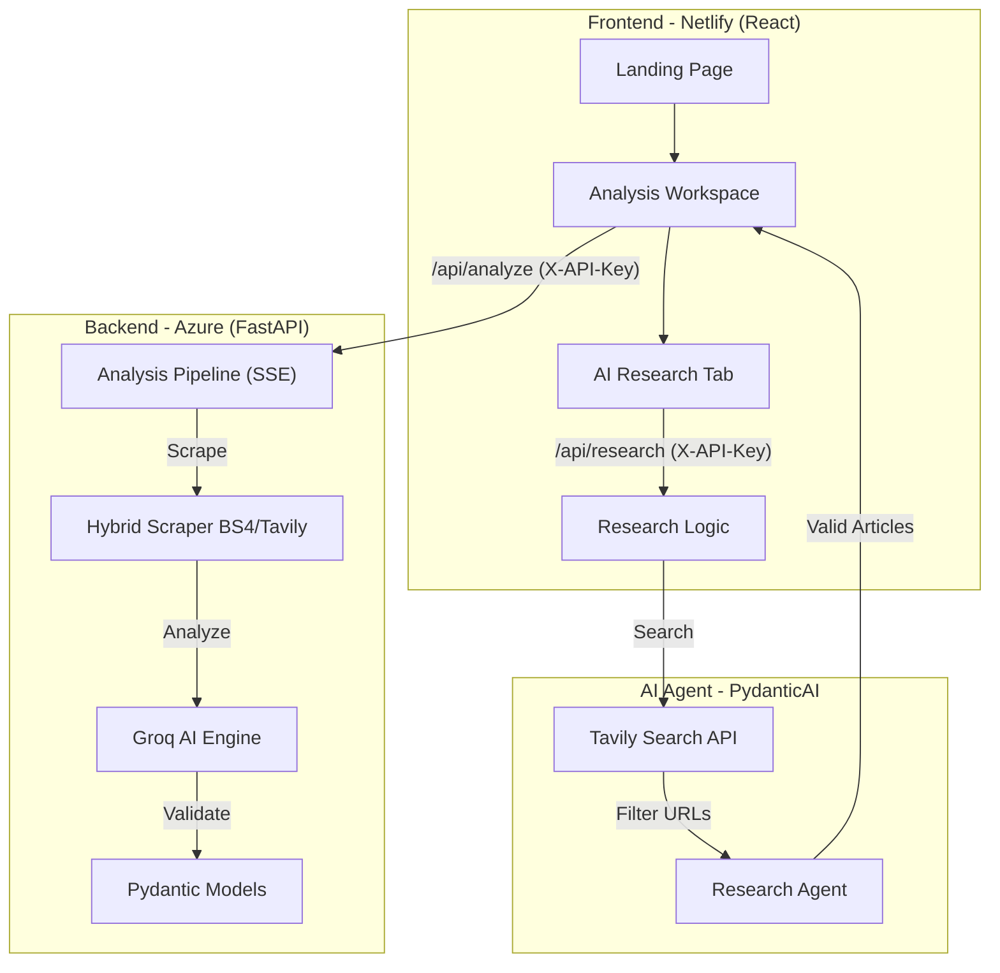

<div align="center">

  # Omnius — Automated Media Intelligence
  **Automated Framing Analysis using Robert Entman's Methodology & LLM Intelligence.**
  
  [](https://reactjs.org/)
  [](https://www.typescriptlang.org/)
  [](https://tailwindcss.com/)
  [](https://fastapi.tiangolo.com/)
  [](https://www.python.org/)
  [](https://vitejs.dev/)
  [](https://www.docker.com/)
  [](https://azure.microsoft.com/)
  [](https://www.netlify.com/)
  [](https://console.groq.com/)
  [](https://pydantic.dev/)
  [](https://opensource.org/licenses/MIT)
</div>

---

## 🌐 Live Production
- **Frontend Workspace**: [omnius-news-analysis.netlify.app](https://omnius-news-analysis.netlify.app)
- **Backend API Health**: [omnius-api-flx.azurewebsites.net/api/health](https://omnius-api-flx.azurewebsites.net/api/health)

---

## Overview

**Omnius** is a professional media intelligence platform that implements **Robert Entman's (1993)** framing theory to automatically dissect online news narratives. 

In an era of information warfare and systemic bias, Omnius provides a "truth-telling" lens that transforms static news text into deep analytical insights. It identifies how media outlets define problems, interpret causes, make moral evaluations, and recommend treatments across different sources.

## Core Features

- **Autonomous AI Research Agent**: Powered by **Pydantic AI**, an intelligent agent that autonomously searches and filters high-quality news articles across the internet based on user topics.
- **Automated Framing Intelligence**: Identifies Robert Entman's 4 framing pillars using state-of-the-art LLMs (**Llama 3.3 70B**, **Llama 3.1 8B**, and **Qwen 3 32B**) with high-speed inference via **Groq Cloud**.
- **Real-time Progress Streaming**: Implements **Server-Sent Events (SSE)** to provide live feedback during the scraping and multi-stage analysis process, ensuring transparency in the AI reasoning chain.
- **Advanced Scraping Fallback**: Hybrid scraping engine utilizing **BeautifulSoup4** for standard extraction and **Tavily Extraction API** as a robust fallback for sites with anti-bot protections.
- **Comparative Synthesis**: Generates high-level intelligence reports that find common ground and key discrepancies between different media outlets.
- **Narrative Network Matrix**: Interactive **D3.js-powered** graph visualization that reveals the "Shared Nucleus" of keywords connecting different sources.
- **Security Hardened**: Protected by **X-API-Key** header validation and strictly enforced **CORS** domain white-listing to ensure only authorized frontend origins can access the AI pipeline.
- **Model Configurator**: Hot-swap between different LLM engines to adjust analysis depth and speed directly from the workspace.

---

## Cloud Infrastructure & CI/CD

Omnius utilizes a modern, decoupled cloud architecture designed for high availability, security, and automated delivery:

- **Frontend Hosting**: **Netlify** provides global CDN edge delivery and automated preview deployments.
- **Backend Hosting**: **Azure App Service (Linux)** running the FastAPI application as a **Docker Container**.
- **Container Registry**: **Azure Container Registry (ACR)** stores production images, accessible via **Managed Identity (AcrPull)** for enhanced security.
- **CI/CD Pipeline**: **GitHub Actions** automates the entire lifecycle:
  - Automated unit testing with **Pytest**.
  - Docker multi-stage builds and automated push to ACR.
  - Zero-downtime deployment to Azure on every push to the `main` branch.
  - Automatic synchronization of production environment variables.

### Deployment Architecture


---

## Technology Stack

### Backend (Python & FastAPI)
- **Agent Framework**: **Pydantic AI** (Agentic AI orchestration)
- **LLM Integration**: **Groq Cloud** (Llama 3.3-70B, Llama 3.1-8B, Qwen 2.5 32B)
- **Search & Extraction**: **Tavily API** (Autonomous search & AI-powered content extraction)
- **Framework**: **FastAPI** (Asynchronous High-Performance API)
- **Scraping Engine**: **BeautifulSoup4** with **lxml** parser
- **Fault Tolerance**: **Tenacity** (Retry logic for robust AI pipeline)
- **Infrastructure**: **Docker** & **Azure Container Apps/App Service**

### Frontend (React & TypeScript)
- **Framework**: **React 19** with **Vite 6**
- **Styling**: **Tailwind CSS v4** & **Motion v12** (Fluid animations)
- **Visualization**: **D3.js** (Dynamic Network Graphs) & **Lucide React** (Professional Iconography)
- **Content Rendering**: **React Markdown** (LLM Synthesis display)

---

## System Architecture



---

## Getting Started

### Prerequisites
*   Python 3.12+
*   **uv** (Fast Python package manager)
*   Node.js 22+ & npm
*   API Keys: Groq Cloud, Tavily, and a custom `OMNIUS_API_KEY`.

### 1. Backend Setup
```bash
cd backend

# Install dependencies using uv
uv sync

# Create .env file from the example template
cp .env.example .env

# Configure your API keys in the .env file
# OMNIUS_API_KEY=your_secret_key
# GROQ_API_KEY=your_groq_key
# TAVILY_API_KEY=your_tavily_key

# Run the server locally
uv run uvicorn app.main:app --host 0.0.0.0 --port 8000 --reload
```

### 2. Frontend Setup
```bash
cd frontend

# Install dependencies
npm install

# Create local environment configuration
echo "VITE_API_URL=http://localhost:8000" > .env.local
echo "VITE_API_KEY=your_omnius_api_key" >> .env.local

# Start development server
npm run dev
```

The local application will be available at `http://localhost:5173`.

---

## Methodology

Omnius implements the **Robert Entman's Framing Theory (1993)**, which identifies:
1. **Problem Definition**: What is the core issue at hand?
2. **Causal Interpretation**: Who or what is blamed for the problem?
3. **Moral Evaluation**: How are the actors and actions judged?
4. **Treatment Recommendation**: What is the suggested solution or path forward?

By comparing these pillars across sources, Omnius reveals the systematic "framing" that shapes public perception.

---

## License

This project is licensed under the **MIT License**. See the [LICENSE](LICENSE) file for details.

---

## Author

**Felix Hardyan**
*   [GitHub](https://github.com/flxhrdyn)
*   [Hugging Face](https://huggingface.co/felixhrdyn)

---
